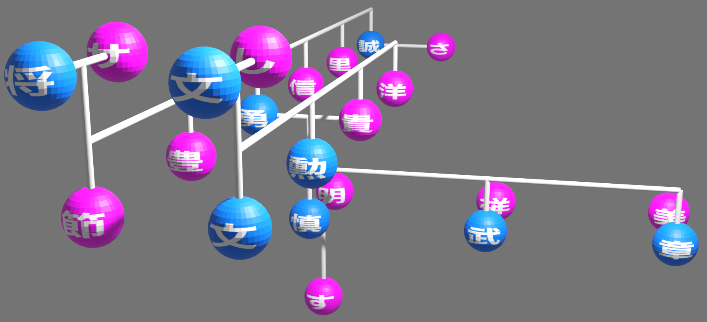

# FamilyTree3D



## Usage

```
cd FamilyTree3D
mkdir data
```

- Create your own .csv file under `data/` or download sample from [here](https://drive.google.com/drive/folders/1O1x_nGjIGkQcmhabONKtKexT-C-WGQY1?usp=drive_link).

```
python read_csv.py -i data/${PATH}.csv \
    --center ${PERSON}  # Option
```
- Generate a family model (`**.pkl`) from the input csv file.

- Open blender from CLI. (ex: `/Applications/Blender.app/Contents/MacOS/Blender`)
- Open `viewer.py` from blender's "scirpting".

```
# viewer.py, Line 9
MODEL_PATH = WORKDIR / "data/**.pkl" # Rename here!!
```
- Change `MODEL_PATH` for your own family model.